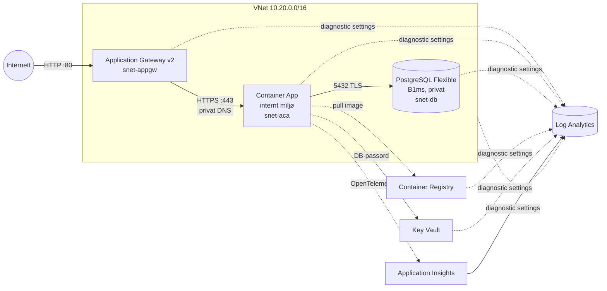

# srelabinfra

Infrastruktur (Bicep og GitHub Actions) for en enkel demo-app på Azure Container Apps. Appen utvikles i et eget repo. Dette repoet gir plattformen den kjører på, med full logging til Log Analytics, slik at Azure SRE Agent og Azure Monitor kan kobles på senere.

Driftsdokumentasjon: [docs/baseline.md](docs/baseline.md) beskriver normaltilstand, SLO-er og terskler for avvik.

## Arkitektur



| Ressurs | Navn (dev) | Kommentar |
|---|---|---|
| Resource group | `rg-srelab-dev` | |
| Log Analytics | `log-srelab-dev-<suffix>` | Alle logger og metrikker havner her |
| Application Insights | `appi-srelab-dev` | Workspace-basert, for applikasjonstelemetri |
| VNet og NSG-er | `vnet-srelab-dev` | Subnett for AppGW, ACA (/23) og DB |
| Application Gateway | `agw-srelab-dev` | Standard_v2 med autoscale 0–2 og offentlig IP med DNS-navn |
| Container Apps-miljø | `cae-srelab-dev` | Internt (ikke eksponert), Consumption workload profile |
| Container App | `ca-srelab-dev` | 1–3 replikaer, user-assigned identity |
| Container Registry | `acrsrelabdev<suffix>` | Basic. Appen henter image med managed identity |
| Key Vault | `kv-srelab-dev-<suffix>` | RBAC. Holder `db-password` |
| PostgreSQL | `psql-srelab-dev-<suffix>` | Burstable B1ms, PG 16, kun privat tilgang |

## Logging

| Kilde | Hvordan | Tabeller (eksempler) |
|---|---|---|
| Activity Log (subscription) | Diagnostic setting på subscription | `AzureActivity` |
| Application Gateway | Diagnostic setting, resource-specific | `AGWAccessLogs`, `AGWPerformanceLogs`, `AzureMetrics` |
| Container Apps (stdout/stderr og system) | Diagnostic setting på miljøet | `ContainerAppConsoleLogs`, `ContainerAppSystemLogs` |
| Appens telemetri | App Insights via `APPLICATIONINSIGHTS_CONNECTION_STRING` | `AppRequests`, `AppDependencies`, `AppTraces`, `AppExceptions` |
| PostgreSQL | Diagnostic setting | `AzureDiagnostics` (PostgreSQLLogs, sesjoner, Query Store) |
| Key Vault, ACR, NSG, VNet, Public IP, Log Analytics | Diagnostic setting (allLogs og AllMetrics) | `AzureDiagnostics`, `ContainerRegistryLoginEvents`, `AzureMetrics` |

Eksempelspørringer:

```kusto
// Feilede requests gjennom Application Gateway
AGWAccessLogs | where HttpStatus >= 500 | summarize count() by bin(TimeGenerated, 5m), HttpStatus

// Applikasjonslogger fra containeren
ContainerAppConsoleLogs | where ContainerAppName == "ca-srelab-dev" | project TimeGenerated, Log | order by TimeGenerated desc

// Restarter og probe-feil i Container Apps
ContainerAppSystemLogs | where Reason in ("BackOff", "ProbeFailed", "ContainerTerminated")
```

## Kom i gang

### 1. Engangsoppsett (OIDC og GitHub-variabler)

```bash
az login
gh auth login
./scripts/bootstrap.sh <subscription-id>            # repo: mariusremman/srelabinfra, miljø: dev
```

Scriptet gjør dette:
- registrerer resource providers
- lager en Entra-app med federerte credentials for `main`, PR-er og environment `dev`
- gir appen rollene **Contributor** og **Role Based Access Control Administrator** på subscriptionen. Den siste trengs fordi Bicep oppretter rolletildelinger for AcrPull og Key Vault Secrets User.
- setter GitHub-variablene `AZURE_CLIENT_ID`, `AZURE_TENANT_ID`, `AZURE_SUBSCRIPTION_ID` og `ENVIRONMENT_NAME`
- genererer secreten `POSTGRES_ADMIN_PASSWORD`

### 2. Deploy

Push til `main`, eller kjør **Actions → infra → Run workflow**.

- **PR:** bygger og linter Bicep, og kjører `what-if`.
- **main:** kjører `what-if` og deretter `deploy`. Outputs (app-URL, ACR og så videre) vises i job summary.

Første deploy tar ca. 15–20 minutter. Det er Application Gateway og PostgreSQL som tar tid. Inntil app-repoet har deployet noe, kjører appen Microsofts placeholder-image. Åpne `appUrl` fra outputs for å verifisere at kjeden fungerer.

Valgfrie GitHub-variabler er `NAME_PREFIX`, `AZURE_LOCATION`, `CONTAINER_PORT` (standard `8080`) og `HEALTH_PROBE_PATH` (standard `/`).

### Lokal deploy

```bash
export POSTGRES_ADMIN_PASSWORD='...' NAME_PREFIX=srelab ENVIRONMENT_NAME=dev
eval "$(./scripts/current-image.sh | tail -1)"
az deployment sub create -n srelab-dev-norwayeast -l norwayeast --parameters infra/main.bicepparam
```

## Demo-app (`app/`)

Appen er skrevet i FastAPI og bruker PostgreSQL. [`.github/workflows/app.yml`](.github/workflows/app.yml) kjører når noe under `app/` endres:
- **PR:** bygger imaget med Docker og kjører en røyktest.
- **main:** pusher til ACR, oppdaterer container appen og venter til ny versjon svarer via Application Gateway.

| Endepunkt | Hva det gjør | Hvor det synes |
|---|---|---|
| `GET /`, `/health`, `/ready` | Info, liveness og DB-readiness | `AppRequests` |
| `GET/POST /api/items` | CRUD mot PostgreSQL | `AppRequests` og `AppDependencies` |

## Kontrakt mot appen

Appen får disse miljøvariablene:

| Variabel | Innhold |
|---|---|
| `PORT` | Porten appen skal lytte på (8080) |
| `APPLICATIONINSIGHTS_CONNECTION_STRING` | Til Azure Monitor OpenTelemetry Distro |
| `OTEL_SERVICE_NAME` | `ca-srelab-dev` |
| `DB_HOST`, `DB_PORT`, `DB_NAME`, `DB_USER` | PostgreSQL-tilkobling |
| `DB_PASSWORD` | Hentes fra Key Vault via managed identity |
| `DB_SSLMODE` | `require` |

Krav til appen:
- Den lytter på `PORT` (8080).
- Den svarer med 2xx/3xx på `HEALTH_PROBE_PATH`. Lag gjerne `/health` og sett variabelen.
- Den logger til stdout. Da havner loggene i `ContainerAppConsoleLogs`.
- Den bruker [Azure Monitor OpenTelemetry Distro](https://learn.microsoft.com/azure/azure-monitor/app/opentelemetry-enable) for requests, dependencies og traces.

Deploy fra app-repoet: gi app-repoets GitHub-identitet rollene **AcrPush** på registryet og **Contributor** på resource groupen (eller bare på container appen). Deretter:

```bash
ACR=<acrName fra outputs>
az acr build -r $ACR -t app:${GITHUB_SHA} .
az containerapp ingress update -n ca-srelab-dev -g rg-srelab-dev --target-port 8080   # bare nødvendig første gang
az containerapp update -n ca-srelab-dev -g rg-srelab-dev --image $ACR.azurecr.io/app:${GITHUB_SHA}
```

Infra-workflowen leser imaget som kjører, og beholder det. En infra-deploy ruller derfor ikke tilbake appen.

## Kostnad (omtrent, norwayeast)

| Ressurs | ca. USD/mnd |
|---|---|
| Application Gateway Standard_v2 (fast pris og lite trafikk) | 180 |
| PostgreSQL B1ms og 32 GB | 15 |
| Container App (1 replika, 0,5 vCPU / 1 GiB, alltid på) | 25–30 |
| ACR Basic | 5 |
| Log Analytics og App Insights | avhenger av volum (ca. 2,3 USD/GB) |

Application Gateway er den klart største posten. Slett resource groupen når laben ikke er i bruk.

## Rydde opp

```bash
az group delete -n rg-srelab-dev --yes
az monitor diagnostic-settings subscription delete -n activitylog-to-srelab-dev --yes
az keyvault purge -n kv-srelab-dev-<suffix>    # soft delete holder navnet i 7 dager
```

## Videre (SRE Agent og Azure Monitor)

- Koble Azure SRE Agent til `rg-srelab-dev`. Alle signaler ligger i `log-srelab-dev-<suffix>`.
- Legg til action group og alert-regler, for eksempel 5xx i `AGWAccessLogs`, unhealthy backend, restarter i Container App og CPU/storage på PostgreSQL.
- Lag en workbook eller dashboard for app og infra.
- Vurder HTTPS på Application Gateway (sertifikat fra Key Vault) og WAF_v2.
